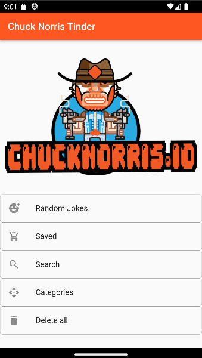
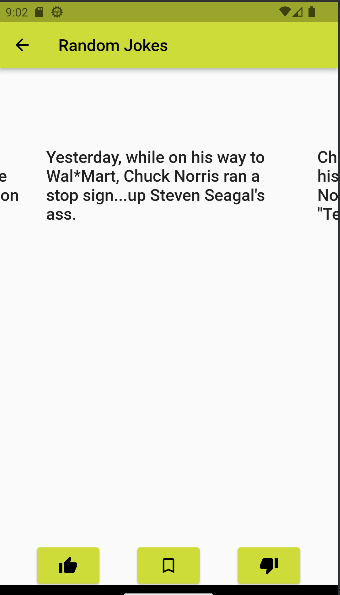
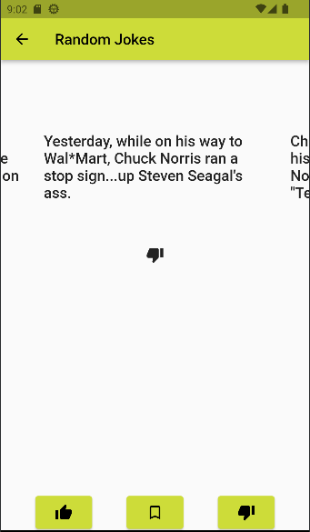
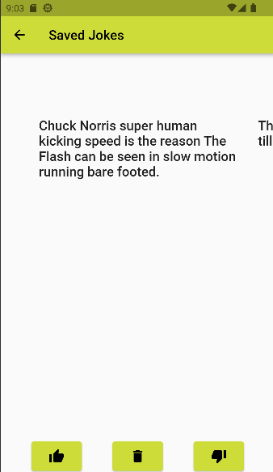
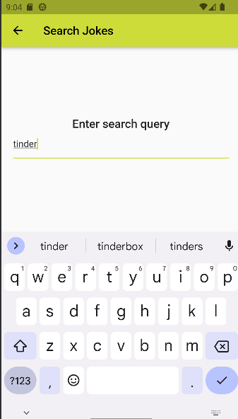
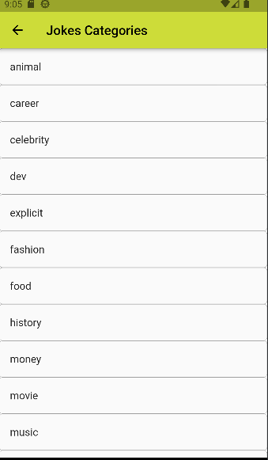

# Chuck Norris Tinder
Flutter project for Flutter course.

## Instruments

* Dependence management `Riverpod` (theming)
* `Firebase Crashlytics`
* Storage `Hive`

## Screenshots

Main menu 

Random jokes before end after dislike 

Saved jokes 

Search and categories  

## Build

App build for Android: [apk](./build/app/outputs/flutter-apk/app-release.apk)

## Author

Roman Mukhtarov
tg: @romanza705